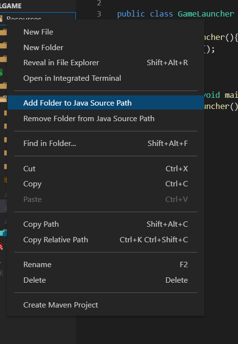

# Chorus Grabber

## Git repo
LINK HERE

## Important Notice

The server and client side are message are not implemented for this game.

## Requirements
- Java 16

## Installation instructions (VS Code example)
1. Clone the directory
2. Open <code>src/game/GameLauncher.java</code> for VS Code to detect the project as a Java project
3. Add resources folder to file path, by right-clicking on the resources folder

4. Press run on the GameLauncher.java file

## Unit Tests
Since our application is mostly a renderer, most of our tests are done my running the application. However, there is still JUnit tests available. 